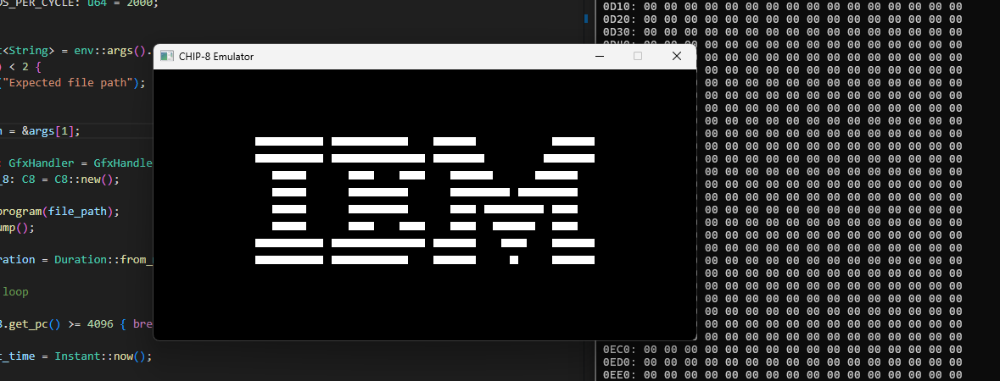

# c8emu



CHIP-8 Emulator written in Rust, using `minifb` for graphics and keypad input and `rodio` for sound.

### Controls
```
CHIP-8 KEYPAD   KEYBOARD
1 2 3 C         1 2 3 4
4 5 6 D         Q W E R
7 8 9 E         A S D F
A 0 B F         Z X C V
```

### Setup
Must have Rust and Cargo installed. https://www.rust-lang.org/tools/install

To clone and build:
```
git clone https://github.com/LuigiDotSRC/c8emu.git
cd c8emu
cargo build --release
```

To run CHIP-8 programs:
```
cargo run -- path/to/rom.ch8
```

### Resources
- [How to write an emulator (CHIP-8 interpreter) by Laurence Muller](https://multigesture.net/articles/how-to-write-an-emulator-chip-8-interpreter/)
- [awesome-chip-8: List of awesome resources by tobiasvl](https://github.com/tobiasvl/awesome-chip-8)